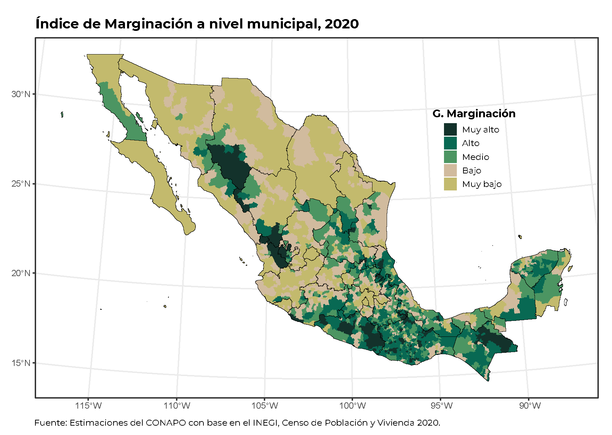
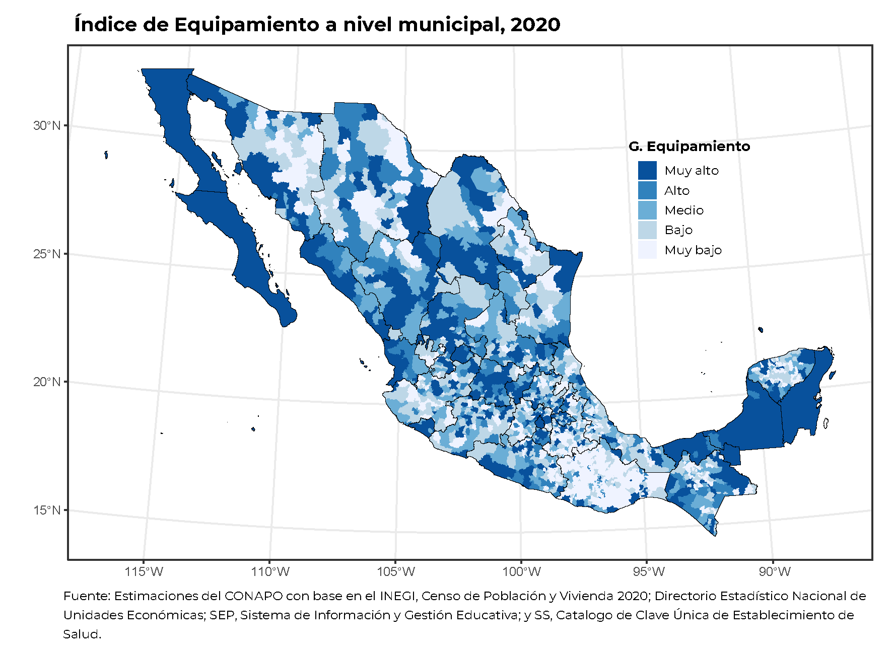
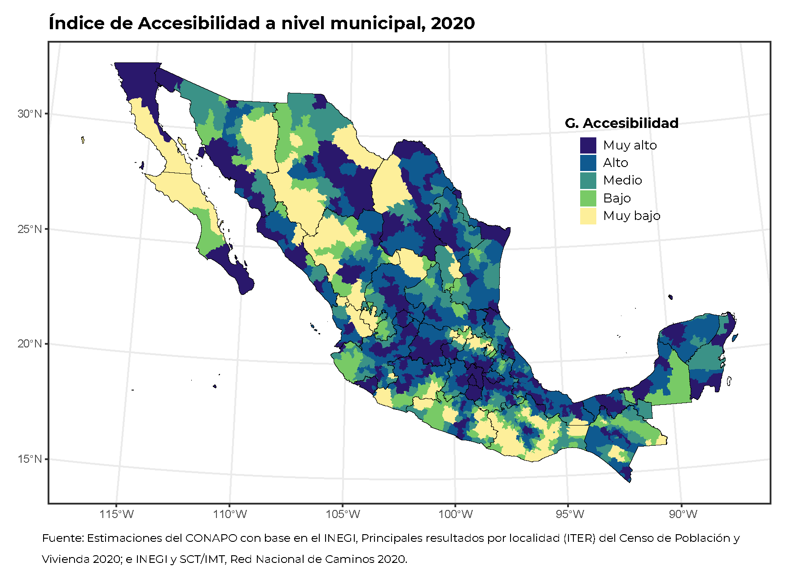

```{=html}
<style type="text/css">
body {
text-align: justify;
font-style: normal;
font-family: "Montserrat";
font-size: 12px
}
h1.title {
  font-size: 40px;
  color: #000D3B;
}
h1 {
  color: #B6854D;
}
h2 {
  color: #172984;
}
h3 {
  color: #172984;
}
</style>
```

```{=html}
<style>
.nav>li>a {
    position: relative;
    display: block;
    padding: 10px 15px;
    color: #1C3BA4
}
.nav-pills>li.active>a, .nav-pills>li.active>a:hover, .nav-pills>li>a:focus {
    color: #ffffff;
    background-color: #09C2BC
}
</style>
```

```{=html}
<style>
.tile1-text {
    position: relative;
    display: block;
    padding: 10px 15px;
    color: #0A6A87;
    list-style: none;
}
.top1-tiles a:nth-of-type(1):hover, .top-tiles1 a:nth-of-type(1):focus{
    color: #ffffff;
    background: #0A6A87
}
</style>
```

```{=html}
<style>
.tile2-text {
    position: relative;
    display: block;
    padding: 10px 15px;
    color: #0A6CC8;
    list-style: none;
}
.top2-tiles a:nth-of-type(1):hover, .top2-tiles a:nth-of-type(1):focus{
    color: #ffffff;
    background: #0A6CC8
}
</style>
```

```{=html}
<style>
.math {
  font-size: 15px;
  color: #1e42ab;
}
</style>
```

```{r setup, include=FALSE}
knitr::opts_chunk$set(echo = TRUE, message = FALSE, warning = FALSE, cache = FALSE, eval = FALSE, 
                      cache.lazy = FALSE, class.source = "fold-show")
knitr::opts_knit$set(root.dir = here::here())
setwd(here::here())
```

```{r,echo=FALSE, eval=FALSE}
rm(list = ls())
```

```{r, echo = FALSE, results=FALSE}
# Paquetes que se usaron en el documento 
require(dplyr)          #A Grammar of Data Manipulation 
require(ggplot2)        # Generar gráficos ggplot y la geometría de un mapa
require(RColorBrewer)
require(ggspatial)
require(ggpubr)
require(knitr)
require(kableExtra)
require(openxlsx)
require(readxl)
require(rgdal)          #Para importar shapefiles. 
require(sp)             # Classes and Methos for Spatial Data
library(spdep)    # Índice de Moran 
require(spdplyr)        #Data manipulation verbs for the sptial classes
require(tidyverse) 
require(unikn)          # Paleta de colores
```

```{r, echo = FALSE, results=FALSE}
# Se descargan las fuentes de la google fonts
require(showtext)
library(extrafont)
# activar showtext
windowsFonts()
```


## Índice de Calidad del Entorno

El **Índice de Calidad del Entorno (ICE)**, desarrollado por el Consejo Nacional de Población (CONAPO), es un indicador compuesto que busca medir las características de los asentamientos humanos en México, tomando en cuenta factores como la marginación, la disponibilidad de servicios y equipamiento urbano. Su objetivo principal es ofrecer información que sintetice los factores contextuales negativos que limitan la participación e inclusión de las personas, especialmente aquellas con discapacidad.  

**Dimensiones del ICE:**
  
  El ICE se estructura en tres dimensiones principales:
  
  1.  **Dimensión sociodemográfica:** Esta dimensión se basa en indicadores socioeconómicos de los índices de marginación, como el porcentaje de población en pobreza, el nivel de educación, entre otros.
2.  **Dimensión de equipamiento:** Analiza la disponibilidad de equipamiento y servicios públicos y privados, como escuelas, hospitales, parques, etc.
3.  **Dimensión de conectividad:** Evalúa la calidad de la infraestructura de transporte y comunicaciones, así como el acceso a internet y otros servicios.

El ICE es una herramienta útil para:
  
-  **Identificar áreas con mayores carencias:** Permite identificar las zonas donde se concentran los factores que limitan la calidad del entorno, lo que puede ser útil para la toma de decisiones en políticas públicas.
- **Evaluar el impacto de políticas públicas:** El ICE puede ser utilizado para evaluar el impacto de programas y políticas públicas en la calidad del entorno.
- **Promover la inclusión:** Al visibilizar los factores que limitan la inclusión de las personas, el ICE puede contribuir a la promoción de políticas que mejoren la calidad de vida de todos los ciudadanos.

**Limitaciones del ICE:**
  
  Es importante tener en cuenta que el ICE tiene algunas limitaciones:
  
-  **Disponibilidad de información:** La disponibilidad de información para calcular el ICE puede ser limitada en algunas zonas.
-  **Complejidad del fenómeno:** La calidad del entorno es un fenómeno complejo que no puede ser abarcado en su totalidad por un solo indicador.
 
 
```{r,results=FALSE,class.source = "fold-show"}
shape_estados <- readOGR(dsn ="D:/MGN/MGN 2020/MGN 2020/conjunto_de_datos", 
                             layer = "00ent",
                              encoding = "UTF-8",
                               use_iconv = TRUE)
```

```{r,results=FALSE,class.source = "fold-show"}
shape_municipios <- readOGR(dsn ="D:/MGN/MGN 2020/MGN 2020/conjunto_de_datos", 
                             layer = "00mun",
                              encoding = "UTF-8",
                               use_iconv = TRUE)
```

**Shapefile localidades (polígonos) 2020**

```{r}
shape_localidad <- readOGR(dsn ="D:/MGN/MGN 2020/MGN 2020/conjunto_de_datos", 
                            layer = "00l",
                             encoding = "UTF-8",
                              use_iconv = TRUE)

## Se filtra por AMBITO == "Urbana"
shape_localidad <- shape_localidad %>%
                    filter(AMBITO == "Urbana") %>%
                     rename("CVE_GEO" = "CVEGEO")
```

**Shapefile localidades (puntos) 2020**

```{r}
shape_localidad_p <- readOGR(dsn ="D:/MGN/MGN 2020/MGN 2020/conjunto_de_datos", 
                             layer = "00lpr",
                             encoding = "UTF-8",
                             use_iconv = TRUE)
```

## Municipal  

### Base de datos

La base de datos del índice de calidad del entorno por localidades se encuentra disponible en la página oficial de [CONAPO](https://www.gob.mx/conapo/documentos/indice-de-calidad-del-entorno?idiom=es) o bien se puede consultar en la página de [Datos Abiertos](https://datos.gob.mx/) y se presenta en formato `.xlsx` [Consulta](http://www.conapo.gob.mx/work/models/CONAPO/Datos_Abiertos/DT/ICE_2020.zip).


```{r, class.source = "fold-show"}
data <- read_xlsx("Bases/Indice de calidad del entorno a nivel municipal.xlsx", sheet = "ICE_2020") %>%
          mutate(CVE_GEO = CVE_MUN) %>%
           as.data.frame()
```


### SpatialPolygons

Se fusionan los datos del `shape_municipios` con datos estadísticos del índice de calidad del entorno a nivel municipal (`IMM_2020`), excluyendo las claves estatales y municipales (`CVE_MUN`) y asegurando que `G_ICE` se ordene de acuerdo a los grados de calidad del entorno, de igual manera los grados de marginación (`GM_2020`), equipamiento (`G_IE`) y accesibilidad (`GACC`). El resultado es `layer_municipios`, un objeto que contiene a los municipios junto con sus atributos actualizados, lo que facilita su análisis y visualización en mapas.

#### $$SpatialPolygons \Rightarrow SpatialPolygons + Datos$$

```{r, class.source = "fold-show"}
layer_municipios <- merge(shape_municipios,
                           data %>% dplyr::select(c(-CVE_MUN)) %>%
                                         mutate(G_ICE = fct_relevel(.$G_ICE,"Muy alto", "Alto", "Medio", "Bajo", "Muy bajo"),
                                                GM_2020 = fct_relevel(.$GM_2020, "Muy alto", "Alto", "Medio", "Bajo", "Muy bajo"),
                                                G_IE = fct_relevel(.$G_IE, "Muy alto", "Alto", "Medio", "Bajo", "Muy bajo"),
                                                GACC = fct_relevel(.$GACC, "Muy alto", "Alto", "Medio", "Bajo", "Muy bajo")),
                            by = "CVE_GEO")
```

**Índice de Calidad del Entorno**  

```{r, fig.height=8, fig.width=10, eval = FALSE, class.source = "fold-hide"}
# Paleta de colores 
require(RColorBrewer)
require(ggspatial)
require(ggpubr)

values = rev(brewer.pal(5, "RdPu"))
                          
p <- ggplot() + 
      layer_spatial(layer_municipios, aes(fill = G_ICE), color = "transparent") + 
       layer_spatial(shape_estados, fill = "transparent", color = "black") + 
        theme_bw() + 
         theme(plot.title = element_text(size = 22, hjust = 0.15, family = "Montserrat", face = "bold"),
               plot.caption = element_text(size = 11, hjust = 0.2, vjust = 1, family = "Montserrat"), 
               legend.key.size = unit(0.5, "cm"),
               legend.text = element_text(size = 12, family = "Montserrat"), 
               legend.title = element_text(size = 10, hjust = 0.5, family = "Montserrat", face = "bold"),
               legend.position = "right"
               ) + 
          scale_fill_manual(values = values) + 
           scale_color_manual(values = c("#BDBDBD")) + 
            #guides(color = guide_legend(override.aes = list(fill = usecol(pal = pal_petrol, n = 5)))) +
     labs(title = "Índice de Calidad del Entorno a nivel municipal, 2020",
           fill = stringr::str_wrap("ICE", 10), 
            caption = stringr::str_wrap(paste("Fuente: Estimaciones del CONAPO con base en el INEGI, Censo de Población y Vivienda 2020 y Directorio Estadístico Nacional de Unidades Económicas; SEP, Sistema de Información y Gestión Educativa; y SS, Catálogo de Clave Única de Establecimientos de Salud."), 100))
p
#path = "Output/Mapa del ICE a nivel municipal.pdf"
#ggexport(p, filename = path ,width = 10, height = 10, device = "cairo")
```

{width="70%" fig-align="center"}

**Índice de Marginación 2020**  

```{r, fig.height=8, fig.width=10, eval = FALSE, class.source = "fold-hide"}
# Paleta de colores 
require(RColorBrewer)
require(ggspatial)
require(ggpubr)

values =   c("#13322B", #Muy alto
             "#086953", #Alto 
             "#4C9562", #Medio
             "#D1BB9E", #Bajo
             "#C3BA6D") # Muy bajo
                          
p <- ggplot() + 
      layer_spatial(layer_municipios, aes(fill = GM_2020), color = "transparent") + 
       layer_spatial(shape_estados, fill = "transparent", color = "black") + 
        theme_bw() + 
         theme(plot.title = element_text(size = 22, hjust = 0.15, family = "Montserrat", face = "bold"),
               plot.caption = element_text(size = 11, hjust = 0.2, vjust = 1, family = "Montserrat"), 
               legend.key.size = unit(0.5, "cm"),
               legend.text = element_text(size = 9, family = "Montserrat"), 
               legend.title = element_text(size = 10, hjust = 0.5, family = "Montserrat", face = "bold"),
               legend.position = "right"
               ) + 
          scale_fill_manual(values = values) + 
           scale_color_manual(values = c("#BDBDBD")) + 
            #guides(color = guide_legend(override.aes = list(fill = usecol(pal = pal_petrol, n = 5)))) +
     labs(title = "Índice de Marginación a nivel municipal, 2020",
           fill = stringr::str_wrap("G. Marginación", 15), 
            caption = stringr::str_wrap(paste("Fuente: Estimaciones del CONAPO con base en el INEGI, Censo de Población y Vivienda 2020."), 100))
p
#path = "Output/Mapa del índice de marginación municipal.pdf"
#ggexport(p, filename = path ,width = 10, height = 10, device = "cairo")
```

{width="70%" fig-align="center"}

**Índice de Equipamiento**  

```{r, fig.height=8, fig.width=10, eval = FALSE, class.source = "fold-hide"}
# Paleta de colores 
require(RColorBrewer)
require(ggspatial)
require(ggpubr)

values =   rev(brewer.pal(5, "Blues"))
                          
p <- ggplot() + 
      layer_spatial(layer_municipios, aes(fill = G_IE), color = "transparent") + 
       layer_spatial(shape_estados, fill = "transparent", color = "black") + 
        theme_bw() + 
         theme(plot.title = element_text(size = 22, hjust = 0.15, family = "Montserrat", face = "bold"),
               plot.caption = element_text(size = 11, hjust = 0.2, vjust = 1, family = "Montserrat"), 
               legend.key.size = unit(0.5, "cm"),
               legend.text = element_text(size = 9, family = "Montserrat"), 
               legend.title = element_text(size = 10, hjust = 0.5, family = "Montserrat", face = "bold"),
               legend.position = "right"
               ) + 
          scale_fill_manual(values = values) + 
           scale_color_manual(values = c("#BDBDBD")) + 
            #guides(color = guide_legend(override.aes = list(fill = usecol(pal = pal_petrol, n = 5)))) +
     labs(title = "Índice de Equipamiento a nivel municipal, 2020",
           fill = stringr::str_wrap("G. Equipamiento", 15), 
            caption = stringr::str_wrap(paste("Fuente: Estimaciones del CONAPO con base en el INEGI, Directorio Estadístico Nacional de Unidades Económicas; SEP, Sistema de Información y Gestión Educativa; y SS, Catálogo de Clave Única de Establecimientos de Salud."), 100))
p
#path = "Output/Mapa del índice de equipamiento municipal.pdf"
#ggexport(p, filename = path ,width = 10, height = 10, device = "cairo")
```

{width="70%" fig-align="center"}

**Índice de Accesibilidad**  

```{r, fig.height=8, fig.width=10, eval = FALSE, class.source = "fold-hide"}
# Paleta de colores 
require(RColorBrewer)
require(ggspatial)
require(ggpubr)

values =  pals::ocean.haline(5)
#values = rev(c("#1A0086", "#1F42D5", "#4B9B41", "#C0CC23", "#f7e65a"))
                          
p <- ggplot() + 
      layer_spatial(layer_municipios, aes(fill = GACC), color = "transparent") + 
       layer_spatial(shape_estados, fill = "transparent", color = "black") + 
        theme_bw() + 
         theme(plot.title = element_text(size = 22, hjust = 0.15, family = "Montserrat", face = "bold"),
               plot.caption = element_text(size = 11, hjust = 0.2, vjust = 1, family = "Montserrat"), 
               legend.key.size = unit(0.5, "cm"),
               legend.text = element_text(size = 9, family = "Montserrat"), 
               legend.title = element_text(size = 10, hjust = 0.5, family = "Montserrat", face = "bold"),
               legend.position = "right"
               ) + 
          scale_fill_manual(values = values) + 
           scale_color_manual(values = c("#BDBDBD")) + 
            #guides(color = guide_legend(override.aes = list(fill = usecol(pal = pal_petrol, n = 5)))) +
     labs(title = "Índice de Accesibilidad a nivel municipal, 2020",
           fill = stringr::str_wrap("G. Accesibilidad", 20), 
            caption = stringr::str_wrap(paste("Fuente: Estimaciones del CONAPO con base en el INEGI, Principales resultados por
localidad (ITER) del Censo de Población y Vivienda 2020; e INEGI y SCT/IMT. Red Nacional de Caminos 2020."), 100))
p
#path = "Output/Mapa del índice de accesibilidad.pdf"
#ggexport(p, filename = path ,width = 10, height = 10, device = "cairo")
```


{width="70%" fig-align="center"}


## Localidad 

### Base de datos

La base de datos del índice de calidad del entorno por localidades se encuentra disponible en la página oficial de [CONAPO](https://www.gob.mx/conapo/documentos/indice-de-calidad-del-entorno?idiom=es) o bien se puede consultar en la página de [Datos Abiertos](https://datos.gob.mx/) y se presenta en formato `.xlsx` [Consulta](http://www.conapo.gob.mx/work/models/CONAPO/Datos_Abiertos/DT/ICE_2020.zip).


```{r, class.source = "fold-show"}
data <- read_xlsx("Bases/Indice de calidad del entorno a nivel localidad.xlsx", sheet = "ICE_2020") %>%
          mutate(CVE_GEO = CVE_LOC) %>%
           as.data.frame()
```

### SpatialPolygons

Se fusionan los datos del `shape_localidad` con datos estadísticos del índice de calidad del entorno a nivel localidad (`ICE`), excluyendo las claves estatales, municipales y localidad (`CVE_LOC`) y asegurando que `G_ICE` se ordene de acuerdo a los grados de calidad del entorno, de igual manera los grados de marginación (`GM_2020`), equipamiento (`G_IE`) y accesibilidad (`GACC`). El resultado es `layer_municipios`, un objeto que contiene a los municipios junto con sus atributos actualizados, lo que facilita su análisis y visualización en mapas.

#### $$SpatialPolygons \Rightarrow SpatialPolygons + Datos$$

```{r}
layer_localicad <- spdplyr:::inner_join.Spatial(shape_localidad,
                                                data %>% dplyr::select(c(-CVE_LOC)) %>%
                                                               mutate(G_ICE = fct_relevel(.$G_ICE,"Muy alto", "Alto", "Medio", "Bajo", "Muy bajo"),
                                                                      GM_2020 = fct_relevel(.$GM_2020, "Muy alto", "Alto", "Medio", "Bajo", "Muy bajo"),
                                                                      G_IE = fct_relevel(.$G_IE, "Muy alto", "Alto", "Medio", "Bajo", "Muy bajo"),
                                                                      GACC = fct_relevel(.$GACC, "Muy alto", "Alto", "Medio", "Bajo", "Muy bajo")),
                                                  by = "CVE_GEO")

layer_localicad_p <- spdplyr:::inner_join.Spatial(shape_localidad_p,
                                                  data %>% dplyr::select(c(-CVE_LOC)) %>%
                                                               mutate(G_ICE = fct_relevel(.$G_ICE,"Muy alto", "Alto", "Medio", "Bajo", "Muy bajo"),
                                                                      GM_2020 = fct_relevel(.$GM_2020, "Muy alto", "Alto", "Medio", "Bajo", "Muy bajo"),
                                                                      G_IE = fct_relevel(.$G_IE, "Muy alto", "Alto", "Medio", "Bajo", "Muy bajo"),
                                                                     GACC = fct_relevel(.$GACC, "Muy alto", "Alto", "Medio", "Bajo", "Muy bajo")),
                                                  by = "CVE_GEO")
```


