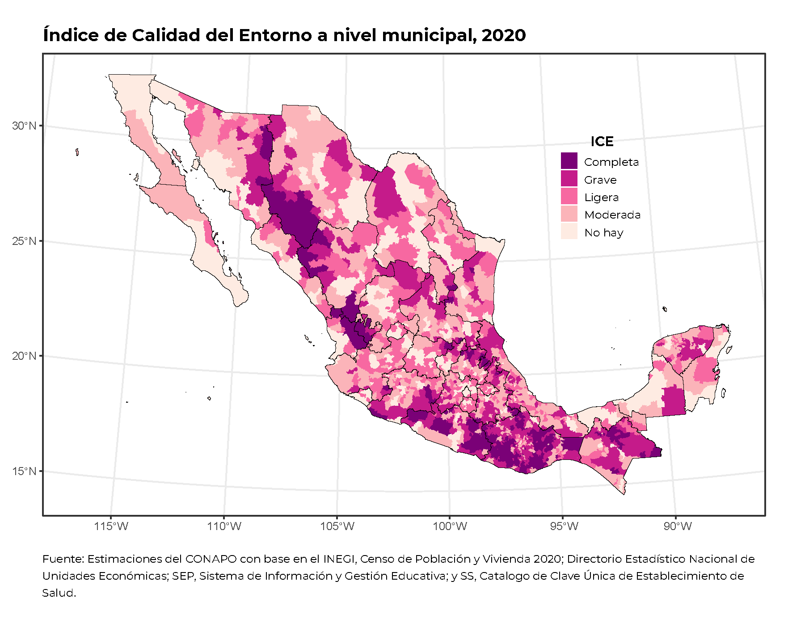

```{=html}
<style type="text/css">
body {
text-align: justify;
font-style: normal;
font-family: "Montserrat";
font-size: 12px
}
h1.title {
  font-size: 40px;
  color: #000D3B;
}
h1 {
  color: #B6854D;
}
h2 {
  color: #172984;
}
h3 {
  color: #172984;
}
</style>
```

```{=html}
<style>
.nav>li>a {
    position: relative;
    display: block;
    padding: 10px 15px;
    color: #1C3BA4
}
.nav-pills>li.active>a, .nav-pills>li.active>a:hover, .nav-pills>li>a:focus {
    color: #ffffff;
    background-color: #09C2BC
}
</style>
```

```{=html}
<style>
.tile1-text {
    position: relative;
    display: block;
    padding: 10px 15px;
    color: #0A6A87;
    list-style: none;
}
.top1-tiles a:nth-of-type(1):hover, .top-tiles1 a:nth-of-type(1):focus{
    color: #ffffff;
    background: #0A6A87
}
</style>
```

```{=html}
<style>
.tile2-text {
    position: relative;
    display: block;
    padding: 10px 15px;
    color: #0A6CC8;
    list-style: none;
}
.top2-tiles a:nth-of-type(1):hover, .top2-tiles a:nth-of-type(1):focus{
    color: #ffffff;
    background: #0A6CC8
}
</style>
```

```{=html}
<style>
.math {
  font-size: 15px;
  color: #1e42ab;
}
</style>
```

```{r setup, include=FALSE}
knitr::opts_chunk$set(echo = TRUE, message = FALSE, warning = FALSE, cache = TRUE, 
                      cache.lazy = FALSE, class.source = "fold-show")
knitr::opts_knit$set(root.dir = here::here())
setwd(here::here())
```

```{r,echo=FALSE, eval=FALSE}
rm(list = ls())
```

```{r, echo = FALSE, results=FALSE}
# Paquetes que se usaron en el documento 
require(dplyr)          #A Grammar of Data Manipulation 
require(ggplot2)        # Generar gráficos ggplot y la geometría de un mapa
require(RColorBrewer)
require(ggspatial)
require(ggpubr)
require(knitr)
require(kableExtra)
require(openxlsx)
require(readxl)
require(rgdal)          #Para importar shapefiles. 
require(sp)             # Classes and Methos for Spatial Data
library(spdep)    # Índice de Moran 
require(spdplyr)        #Data manipulation verbs for the sptial classes
require(tidyverse) 
require(unikn)          # Paleta de colores
```

```{r, echo = FALSE, results=FALSE}
# Se descargan las fuentes de la google fonts
require(showtext)
library(extrafont)
# activar showtext
windowsFonts()
```


## Objetivo   

El análisis espacial con el Índice de Calidad del Entorno (ICE) es una herramienta fundamental que permite comprender la distribución de la calidad del entorno en un territorio específico e identificar patrones geográficos de carencias y desigualdades. Este análisis facilita la visualización en mapas de la distribución del ICE, permitiendo identificar áreas con mayores necesidades y mejores condiciones. También ayuda a determinar zonas prioritarias para intervenciones de políticas públicas, analiza las relaciones entre diferentes factores del ICE (marginación, equipamiento, conectividad) y otras variables geográficas, permite comparar la calidad del entorno entre diferentes áreas geográficas, y facilita el monitoreo de cambios a lo largo del tiempo para evaluar el impacto de las políticas públicas implementadas.

## Índice de Calidad del Entorno

El **Índice de Calidad del Entorno (ICE)**, desarrollado por el Consejo Nacional de Población (CONAPO), es un indicador compuesto que busca medir las características de los asentamientos humanos en México, tomando en cuenta factores como la marginación, la disponibilidad de servicios y equipamiento urbano. Su objetivo principal es ofrecer información que sintetice los factores contextuales negativos que limitan la participación e inclusión de las personas, especialmente aquellas con discapacidad.  

**Dimensiones del ICE:**
  
  El ICE se estructura en tres dimensiones principales:
  
  1.  **Dimensión sociodemográfica:** Esta dimensión se basa en indicadores socioeconómicos de los índices de marginación, como el porcentaje de población en pobreza, el nivel de educación, entre otros.
2.  **Dimensión de equipamiento:** Analiza la disponibilidad de equipamiento y servicios públicos y privados, como escuelas, hospitales, parques, etc.
3.  **Dimensión de conectividad:** Evalúa la calidad de la infraestructura de transporte y comunicaciones, así como el acceso a internet y otros servicios.

El ICE es una herramienta útil para:
  
-  **Identificar áreas con mayores carencias:** Permite identificar las zonas donde se concentran los factores que limitan la calidad del entorno, lo que puede ser útil para la toma de decisiones en políticas públicas.
- **Evaluar el impacto de políticas públicas:** El ICE puede ser utilizado para evaluar el impacto de programas y políticas públicas en la calidad del entorno.
- **Promover la inclusión:** Al visibilizar los factores que limitan la inclusión de las personas, el ICE puede contribuir a la promoción de políticas que mejoren la calidad de vida de todos los ciudadanos.

**Limitaciones del ICE:**
  
  Es importante tener en cuenta que el ICE tiene algunas limitaciones:
  
-  **Disponibilidad de información:** La disponibilidad de información para calcular el ICE puede ser limitada en algunas zonas.
-  **Complejidad del fenómeno:** La calidad del entorno es un fenómeno complejo que no puede ser abarcado en su totalidad por un solo indicador.
 
 
## Análisis espacial  

Utilizando el análisis espacial del ICE es una herramienta poderosa para comprender cómo se distribuye la calidad del entorno en un territorio y para identificar áreas prioritarias para la intervención de políticas públicas. Al visualizar patrones y relaciones espaciales, este tipo de análisis puede contribuir a la toma de decisiones más informadas y a la promoción de un desarrollo más equitativo y sostenible. 

Para realizar un análisis espacial con el ICE, se utilizan herramientas de Sistemas de Información Geográfica (SIG). Estas herramientas permiten:

- **Mapear los datos del ICE**: Se crean mapas que muestran la distribución geográfica de los valores del ICE.  
- **Analizar patrones espaciales**: Se utilizan técnicas estadísticas y geoestadísticas para identificar patrones y tendencias en la distribución del ICE.  
- **Relacionar el ICE con otras variables**: Se combinan los datos del ICE con otras variables geográficas para analizar sus relaciones y comprender mejor los factores que influyen en la calidad del entorno.  

## Correlaciones espaciales

### 1. Moran's I Bivariado (Bivariate Moran's I)  

El **Moran's I Bivariado** (Bivariate Moran’s I) es una extensión del índice de Moran tradicional, que mide la autocorrelación espacial entre dos variables diferentes en una misma área geográfica. En otras palabras, evalúa si los valores altos (o bajos) de una variable en una ubicación están asociados con los valores altos (o bajos) de otra variable en ubicaciones vecinas.

Este método mide la correlación espacial entre dos variables en diferentes ubicaciones. Se calcula como:   

  \[
    I_B = \frac{\sum_i \sum_j w_{ij} (X_i - \bar{X}) (Y_j - \bar{Y})}{S^2 \sum_i \sum_j w_{ij}}
    \]  

donde:  

- \( X_i \) es la variable de pobreza en la unidad espacial \( i \).  
- \( Y_j \) es la variable de equipamiento en la unidad espacial \( j \).  
- \( w_{ij} \) es la matriz de pesos espaciales.  
- \( S^2 \) es la varianza de \( X \).  

 Este índice mide la asociación entre \( X \) en una ubicación y \( Y \) en ubicaciones vecinas, utilizando la matriz de pesos espaciales.

---
  
#### **Interpretación del Moran’s I Bivariado**  
  
  - **\( I_B > 0 \):** Existe una relación positiva entre \( X \) e \( Y \), lo que indica que valores altos (bajos) de \( X \) están asociados con valores altos (bajos) de \( Y \) en áreas vecinas.
- **\( I_B < 0 \):** Existe una relación negativa, es decir, valores altos de \( X \) están asociados con valores bajos de \( Y \) en áreas vecinas y viceversa.
- **\( I_B \approx 0 \):** No hay una relación espacial significativa entre las dos variables.


### 2. LISA Bivariado (`Bivariate Local Moran’s I`)     

El **LISA Bivariado** (*Bivariate Local Moran’s I*) es una extensión del **Local Indicator of Spatial Association (LISA)**, que permite evaluar la correlación espacial entre dos variables en ubicaciones específicas dentro de una región. Su objetivo es identificar clústeres espaciales locales donde los valores de una variable están asociados con los valores de otra variable en ubicaciones vecinas.  


Para cada ubicación \(i\), el **LISA Bivariado** se calcula como:
  
  \[
    I_B(i) = (X_i - \bar{X}) \sum_j w_{ij} (Y_j - \bar{Y})
    \]

Donde:
  
- \( X_i \) es el valor de la variable de interés en la ubicación \( i \).
- \( Y_j \) es el valor de la segunda variable en la ubicación \( j \) (vecina de \( i \)).
- \( \bar{X} \) y \( \bar{Y} \) son las medias de \( X \) e \( Y \), respectivamente.
- \( w_{ij} \) es el peso espacial que indica la relación entre las ubicaciones \( i \) y \( j \), definido en una matriz de pesos espaciales.

  
#### **Interpretación del LISA Bivariado**  

El resultado para cada punto \( i \) indica si existe una relación espacial significativa entre \( X_i \) y \( Y_j \) en su vecindario:
  

```{r, echo = FALSE}
tabla <- data.frame("Patrón espacial" = c("Alto-Alto (HH)", "Bajo-Bajo (LL)", "Alto-Bajo (HL)", "Bajo-Alto (LH)"),
                    "Interpretación" = c("Valores altos de X asociados con valores altos de Y en vecinos",
                                         "Valores bajos de X asociados con valores bajos de Y en vecinos",
                                         "Valores altos de X asociados con valores bajos de Y en vecinos (Outlier espacial)",
                                         "Valores bajos de X asociados con valores altos de Y en vecinos (Outlier espacial)"))
require(knitr)
require(kableExtra)

tabla %>%
 kable(size = 9) %>%
  kable_classic(full_width = FALSE)
```

Los patrones HH y LL indican **clústeres espaciales**, mientras que HL y LH pueden indicar **valores atípicos espaciales**.


### 3. Getis-Ord Bivariado (Bivariate G)   

El **Índice Getis-Ord Bivariado (\(G^*\))**, también conocido como **Bivariate Getis-Ord \(G^*\)**, es una extensión del estadístico **Getis-Ord \(G_i^*\)** que permite analizar la asociación espacial entre dos variables distintas en una misma área geográfica.  

Este índice identifica **clústeres espaciales bivariados**, es decir, lugares donde los valores altos (o bajos) de una variable están asociados con valores altos (o bajos) de otra variable en áreas vecinas.

---

La versión bivariada del Getis-Ord \( G^* \) se define como:
  
  \[
    G_{XY}^*(i) = \frac{\sum_{j} w_{ij} X_j Y_j}{\sum_j X_j Y_j}
    \]

Donde:  

- \( X_j \) y \( Y_j \) son los valores de las variables \(X\) e \(Y\) en la ubicación \(j\).
- \( w_{ij} \) es el peso espacial entre las ubicaciones \(i\) y \(j\), basado en la matriz de pesos espaciales.
- \( \sum_{j} X_j Y_j \) es la suma total de los productos de \(X\) e \(Y\).

**Estandarización Z-score**   

Para determinar la significancia de \( G^*_{XY} \), se utiliza la normalización:  

  
  \[
    Z_{XY}^*(i) = \frac{G_{XY}^*(i) - E(G_{XY}^*)}{S(G_{XY}^*)}
    \]

Donde: 

- \( E(G_{XY}^*) \) es la esperanza matemática del índice.
- \( S(G_{XY}^*) \) es la desviación estándar.

Un **Z-score alto y positivo** indica un **clúster caliente (hot spot)** donde valores altos de \(X\) están asociados con valores altos de \(Y\).  
Un **Z-score bajo y negativo** indica un **clúster frío (cold spot)** con valores bajos de \(X\) asociados a valores bajos de \(Y\).   


### 4. Geary's C Bivariado   

iEl **Índice de Geary’s C Bivariado** es una extensión del índice clásico de **Geary’s C**, pero aplicado a dos variables distintas para analizar la relación espacial entre ellas. Mientras que el **Moran’s I Bivariado** mide la autocorrelación espacial de manera global, el **Geary’s C Bivariado** se centra en **las diferencias locales entre valores vecinos**, por lo que es más sensible a patrones de discontinuidad espacial.   

\[
    C_{XY} = \frac{\sum_{i} \sum_{j} w_{ij} (X_i - Y_j)^2}{2S_0 \sum_{i} (X_i - \bar{X})^2}
    \]

Donde:
  
  - \( X_i \) es el valor de la variable \(X\) en la ubicación \(i\).
- \( Y_j \) es el valor de la variable \(Y\) en la ubicación vecina \(j\).
- \( w_{ij} \) es el peso espacial que define la relación entre \(i\) y \(j\) en la matriz de pesos espaciales.
- \( S_0 = \sum_{i} \sum_{j} w_{ij} \) es la suma total de los pesos espaciales.
- \( \bar{X} \) es la media de \(X\).

El índice **Geary’s C Bivariado** mide **la disimilitud espacial entre dos variables en ubicaciones vecinas**.  

**Interpretación del Geary’s C Bivariado**  
  
```{r, echo = FALSE}
tabla <- data.frame(
  "Valor de C_{XY}" = c("<span style='font-family:Times New Roman;'>C<sub>XY</sub> > 1</span>",
                        "<span style='font-family:Times New Roman;'>C<sub>XY</sub> ≈ 1</span>",
                        "<span style='font-family:Times New Roman;'>C<sub>XY</sub> < 1</span>"),
  "Interpretación" = c(
    "Dispersión espacial: Valores altos de X están asociados con valores bajos de Y en vecinos (patrón de discontinuidad).",
    "Aleatoriedad espacial: No hay un patrón claro entre X e Y.",
    "Clustering espacial: Valores similares de X están cercanos a valores similares de Y en vecinos."
  )
)

tabla %>%
  kable(escape = FALSE, size = 9, align = "c") %>%
  kable_classic(full_width = FALSE)
```


## Shapefile

La función `readOGR` del paquete `rgdal`, extrae automáticamente la información utilizada por otros paquetes `SIG` de código abierto como QGIS y permite a R manejar una gama más amplia de formatos de datos espaciales. Esta función lee datos `OGR` y datos vectoriales, pero solamente permite manejar capas con características geométricas (no mezcla puntos, líneas o polígonos en una sola capa) y a su vez establecerá un sistema de referencia espacial si la capa tiene dichos metadatos.\
Para leer un archivo `shapefile`, se establecen los siguientes argumentos, como `dsn`, en donde se indica el directorio que contiene los shapes y `layer` que es el nombre explícito de la capa a trabajar y dichas capas deben de ir sin la extensión `.shp`.

A continuación, se lee el archivo .shp que contiene de manera integrada la división de el área geoestadística municipal `agem`.

```{r,results=FALSE,class.source = "fold-show"}
shape_estados <- readOGR(dsn ="D:/MGN/MGN 2020/MGN 2020/conjunto_de_datos", 
                             layer = "00ent",
                              encoding = "UTF-8",
                               use_iconv = TRUE)
```

```{r,results=FALSE,class.source = "fold-show"}
shape_municipios <- readOGR(dsn ="D:/MGN/MGN 2020/MGN 2020/conjunto_de_datos", 
                             layer = "00mun",
                              encoding = "UTF-8",
                               use_iconv = TRUE)
```

La función `rename()` del paquete `dplyr` permite cambiar el nombre de la columna de la clave geoestadística a nivel estatal dentro de la base de datos del shape.

```{r,class.source = "fold-show"}
shape_municipios@data <- shape_municipios@data %>%
                          rename("CVE_GEO" = "CVEGEO")
```


### Base de datos

La base de datos del índice de calidad del entorno por municipios se encuentra disponible en la página oficial de [CONAPO](https://www.gob.mx/conapo/documentos/indice-de-calidad-del-entorno?idiom=es) o bien se puede consultar en la página de [Datos Abiertos](https://datos.gob.mx/) y se presenta en formato `.xlsx` [Consulta](http://www.conapo.gob.mx/work/models/CONAPO/Datos_Abiertos/DT/ICE_2020.zip).


```{r, class.source = "fold-show"}
data <- read_xlsx("Bases/Indice de calidad del entorno a nivel municipal.xlsx", sheet = "ICE_2020") %>%
          mutate(CVE_GEO = CVE_MUN) %>%
           as.data.frame()
```

### SpatialPolygons

Se fusionan los datos del `shape_municipios` con datos estadísticos del índice de calidad del entorno a nivel municipal (`IMM_2020`), excluyendo las claves estatales y municipales (`CVE_MUN`) y asegurando que `G_ICE` se ordene de acuerdo a los grados de calidad del entorno, de igual manera los grados de marginación (`GM_2020`), equipamiento (`G_IE`) y accesibilidad (`GACC`). El resultado es `layer_municipios`, un objeto que contiene a los municipios junto con sus atributos actualizados, lo que facilita su análisis y visualización en mapas.

#### $$SpatialPolygons \Rightarrow SpatialPolygons + Datos$$

```{r, class.source = "fold-show"}
layer_municipios <- merge(shape_municipios,
                           data %>% dplyr::select(c(-CVE_MUN)) %>%
                                         mutate(G_ICE = fct_relevel(.$G_ICE,"Muy alto", "Alto", "Medio", "Bajo", "Muy bajo"),
                                                GM_2020 = fct_relevel(.$GM_2020, "Muy alto", "Alto", "Medio", "Bajo", "Muy bajo"),
                                                G_IE = fct_relevel(.$G_IE, "Muy alto", "Alto", "Medio", "Bajo", "Muy bajo"),
                                                GACC = fct_relevel(.$GACC, "Muy alto", "Alto", "Medio", "Bajo", "Muy bajo")),
                            by = "CVE_GEO")
```


**Índice de Calidad del Entorno**  


```{r, fig.height=8, fig.width=10, eval = FALSE, class.source = "fold-hide"}
# Paleta de colores 
require(RColorBrewer)
require(ggspatial)
require(ggpubr)

values = rev(brewer.pal(5, "RdPu"))
                          
p <- ggplot() + 
      layer_spatial(layer_municipios, aes(fill = G_ICE), color = "transparent") + 
       layer_spatial(shape_estados, fill = "transparent", color = "black") + 
        theme_bw() + 
         theme(plot.title = element_text(size = 22, hjust = 0.15, family = "montserrat", face = "bold"),
               plot.caption = element_text(size = 11, hjust = 0.2, vjust = 1, family = "montserrat"), 
               legend.key.size = unit(0.5, "cm"),
               legend.text = element_text(size = 12, family = "montserrat"), 
               legend.title = element_text(size = 10, hjust = 0.5, family = "montserrat", face = "bold"),
               legend.position = "right"
               ) + 
          scale_fill_manual(values = values) + 
           scale_color_manual(values = c("#BDBDBD")) + 
            #guides(color = guide_legend(override.aes = list(fill = usecol(pal = pal_petrol, n = 5)))) +
     labs(title = "Índice de Calidad del Entorno a nivel municipal, 2020",
           fill = stringr::str_wrap("ICE", 10), 
            caption = stringr::str_wrap(paste("Fuente: Estimaciones del CONAPO con base en el INEGI, Censo de Población y Vivienda 2020 y Directorio Estadístico Nacional de Unidades Económicas; SEP, Sistema de Información y Gestión Educativa; y SS, Catálogo de Clave Única de Establecimientos de Salud."), 100))
p
path = "Output/Mapa del ICE a nivel municipal.pdf"
ggexport(p, filename = path ,width = 10, height = 10, device = "cairo")
```

{width="70%" fig-align="center"}
### Centroides

La función `coordinates()` extrae las coordenadas de los centroides de los polígonos en $(x,y)$ de la base de datos espacial y la almacenamos en la variable `coords`, para su posterior uso en el código.

```{r}
# Extrayendo coordenadas desde la base de datos espaciales.
coords = coordinates(layer_municipios)
```


## Moran's I Bivariado (Bivariate Moran's I)   

-   `X_nb_queen` almacena la lista de vecinos generada por `poly2nb()` usando la regla de la reina, con el parámetro `queen = TRUE`.
-   Es un objeto de clase *nb* (neighborhood), que es una estructura que se utiliza para representar relaciones espaciales en análisis de datos espaciales.

```{r}
# Construyendo lista de vecinos con criterio tipo reina
X_nb_queen = poly2nb(layer_municipios, queen = TRUE)  
summary(X_nb_queen)
```

- **La mayoría de los municipios tienen entre 3 y 8 vecinos**, con un promedio de ~5.8 vecinos.  
- **Algunos municipios son casi aislados (solo 1 vecino), mientras que otros tienen hasta 22 vecinos.**  
- **Los municipios más conectados probablemente están en zonas urbanas densas**, mientras que los menos conectados podrían estar en fronteras, islas o regiones rurales.  
- **La red espacial tiene una conectividad moderada (23.67% de conexiones posibles están activas),** lo que sugiere que el mapa tiene una distribución geográfica variada.

### Pesos espaciales 

Se convierte la lista de vecinos `X_nb_queen` (creada previamente con `poly2nb()`) en una matriz de pesos espaciales, que se usará en cálculos como el índice de Moran, Geary o otros modelos espaciales. 

```{r}
weights <- nb2listw(X_nb_queen, style="W", zero.policy = TRUE)  # Se crea matriz de pesos
```

```{r}
library(sfdep)

# Calculo de  Moran's I Bivariado
bivariate_moran <- sfdep::global_moran_bv(x = layer_municipios$ICE, 
                                          y = layer_municipios$IM_2020,
                                          nb = weights[["neighbours"]],
                                          wt = weights[["weights"]]
                                          
                                          )
summary(bivariate_moran)
```


## Lisa 

```{r}
library(sfdep)

# Calculo de  Local Bivariate Moran's I 
bivariate_LISA <- sfdep::local_moran_bv(x = layer_municipios$ICE, 
                                        y = layer_municipios$IM_2020,
                                        nb = weights[["neighbours"]],
                                        wt = weights[["weights"]]
                                        )
```


- **El valor de Moran Bivariado (0.43114) sugiere una autocorrelación espacial positiva entre ICE e IM_2020**: municipios con **Alta** calidad del entorno están rodeados de municipios con **Bajo** índice de marginación, y lo mismo ocurre para valores bajos.  
- **El bootBias negativo sugiere que este valor puede estar sobreestimado**, aunque sigue siendo significativo.  
- **El bajo error estándar (0.010527) indica que la estimación es confiable**.  
  

```{r}
library(sf)
library(sfdep)# Para Moran Bivariado    # Para mapas
library(dplyr)

# Se agregan los valores de LISA a la capa espacial
capa_municipios <- layer_municipios %>%
                     mutate(lisa_I = bivariate_LISA$Ib,  # Índice de Moran local
                            p_value = bivariate_LISA$p_sim  # p-valor de la permutación
                      ) %>%
                      mutate(cluster = case_when( # Se define categorías de clusters espaciales
                                                 lisa_I > 0 & p_value < 0.05 ~ "Cluster Alto-Alto (HH)",
                                                 lisa_I < 0 & p_value < 0.05 ~ "Cluster Bajo-Bajo (LL)",
                                                 lisa_I > 0 & p_value >= 0.05 ~ "No Significativo",
                                                 lisa_I < 0 & p_value >= 0.05 ~ "No Significativo",
                                                 TRUE ~ "No Significativo"
                                              )) %>% 
                        mutate(cluster = factor(.$cluster, 
                                                 levels = c("Cluster Alto-Alto (HH)", "Cluster Bajo-Bajo (LL)", "Cluster Alto-Bajo (HH)", "Cluster Bajo-Alto (HH)", "No Significativo")))

p <-  ggplot() +
       layer_spatial(capa_municipios, aes(fill = cluster), color = "transparent") + 
        layer_spatial(shape_estados, fill = "transparent", color = "black") + 
         scale_fill_manual(values = c("#aa295c", "#c3c3c3", "white")) +
          theme_bw() + 
           theme(plot.title = element_text(size = 14, vjust = 0.5, hjust = 0, family = "montserrat", face = "bold"),
                 plot.subtitle = element_text(size = 12, vjust = 0, hjust = 0, family = "montserrat"),
                 plot.caption = element_text(size = 9, hjust = 0.2, vjust = 1, family = "montserrat"), 
                 legend.key.size = unit(0.5, "cm"),
                 legend.text = element_text(size = 9, family = "montserrat"), 
                 legend.title = element_text(size = 10, hjust = 0.5, family = "montserrat", face = "bold"),
                 legend.position = "right"
                   ) + 
            labs(title = "LISA: Local Moran's I", 
                 subtitle = paste("Índice de Calidad del entorno, \n Índice de marginación a nivel municipal"),
                 fill = "LISA Cluster",
                 caption = stringr::str_wrap(paste("Fuente: Estimaciones del CONAPO con base en el INEGI, Censo de Población y Vivienda 2020 y Directorio Estadístico Nacional de Unidades Económicas; SEP, Sistema de Información y Gestión Educativa; y SS, Catálogo de Clave Única de Establecimientos de Salud."), 100))

p

#path = "Output/Mapa del ICE a nivel localidad.pdf"
#ggexport(p, filename = path ,width = 10, height = 10, device = "cairo")
```

## Referencias 

Anselin, L. (1995). Local Indicators of Spatial Association—LISA. Geographical Analysis, 27(2), 93–115.

Global Spatial Autocorrelation (2). (2019). Retrieved February 3, 2025, from https://geodacenter.github.io/workbook/5b_global_adv/lab5b.html 

Tutorial of rgeoda • rgeoda. (2021). Retrieved February 3, 2025, from https://geodacenter.github.io/rgeoda/articles/rgeoda_tutorial.html

## Librerías

**Librerías que se usaron en el trabajo** 

```{r, collapse=FALSE}
sesion_info <- devtools::session_info()
```

```{r, echo = FALSE}
kable(dplyr::select(tibble::as_tibble(sesion_info$packages %>% dplyr::filter(attached == TRUE)),
                    c(package, loadedversion, source))) %>%
   kable_classic(full_width = TRUE, html_font = "montserrat", font_size = 10) 
```

<a rel="license" href="http://creativecommons.org/licenses/by/4.0/"></a><br />This work by [**Diana Villasana Ocampo**]{xmlns:cc="http://creativecommons.org/ns#" property="cc:attributionName"} is licensed under a <a rel="license" href="http://creativecommons.org/licenses/by/4.0/">Creative Commons Attribution 4.0 International License</a>.

